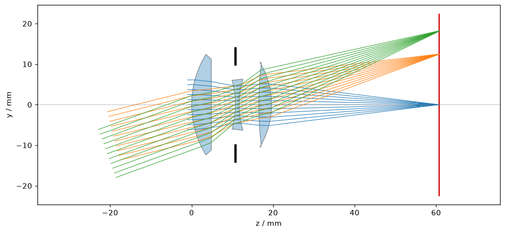

# GUI-Raytatouille: Raytatouille Explorer

[](https://github.com/PhotonPower/GUI-Raytatouille/actions/workflows/ci.yml)

Streamlit-Oberfläche zum Ausprobieren der Python-API von
[Raytatouille](https://github.com/PhotonPower/Raytatouille) (Optikdesign, Raytracing). Man lädt
oder baut ein optisches System und schaut sich Layout, Spot, Ray Fans, Wellenfront, Aberrationen,
Polarisation und Materialien an.



> **Einordnung:** Der Explorer ist ein Erkundungswerkzeug auf der öffentlichen Python-API, nicht die
> geplante Desktop-GUI der Bibliothek (M10, PySide6, [ADR 0012](https://github.com/PhotonPower/Raytatouille/blob/main/docs/adr/0012.md)).
> Er zeigt, was die API für eine GUI hergibt und wo Lücken sind (siehe [docs/roadmap.md](docs/roadmap.md)).

## Funktionen

| Ansicht | Inhalt |
| --- | --- |
| Layout | Linsenschnitt, Blende, Bildebene, Strahlen je Feld und Wellenlänge, verlorene Strahlen |
| Spot | Spot-Diagramm mit RMS/GEO, Airy-Vergleich, Übersicht über alle Felder |
| Ray Fans | Transversale Strahlfehler |
| OPD / Wellenfront | OPD-Karte und -Fan, RMS, PV, Strehl nach Maréchal |
| Verzeichnung & Feldkrümmung | Kurven und Tabellen über das Feld |
| Farbfehler | Längs- und Querfehler |
| Seidel | Seidel-Summen und Beiträge je Fläche |
| Strahlenbündel | Pupillenraster, Strahlstatus, CSV-Export |
| Polarisation | Transmission, Diattenuation, Retardance, Stokes-Vektor, Coatings |
| Materialien | Glaskatalog-Browser, Glaskarte, Dispersion, innere Transmission |
| System-Datei | Export als `.rtt.json` |

Systeme kommen aus den Referenzsystemen der Bibliothek, aus einem Upload (`.rtt.json`) oder aus
dem **Systembaukasten** (Flächentabelle wie in klassischen Optikprogrammen). Funktionen, die die
installierte Bibliotheksversion nicht hat, blendet die App aus ([docs/kompatibilitaet.md](docs/kompatibilitaet.md)).

## Schnellstart

Voraussetzungen: Python ≥ 3.10 und die Bibliothek `raytatouille` (wird aus dem Quellcode gebaut,
Details in [docs/installation.md](docs/installation.md)).

```bash
git clone https://github.com/PhotonPower/Raytatouille.git
git clone https://github.com/PhotonPower/GUI-Raytatouille.git
python -m venv .venv && source .venv/bin/activate
pip install "./Raytatouille[plot]"        # C++-Build, braucht Systempakete
pip install -e ./GUI-Raytatouille
rtt-explorer                               # oder: streamlit run GUI-Raytatouille/streamlit_app.py
```

Das Repo der Bibliothek liefert Beispielsysteme und Kataloge. Die App sucht es automatisch
(Umgebungsvariable `RTT_REPO`, aktueller Ordner oder ein Nachbarordner `Raytatouille`); sonst den
Pfad in der Seitenleiste eintragen.

## Dokumentation

- [Installation](docs/installation.md)
- [Bedienung](docs/bedienung.md)
- [Architektur](docs/architektur.md)
- [Kompatibilität mit Bibliotheksversionen](docs/kompatibilitaet.md)
- [Entwicklung und Tests](docs/entwicklung.md)
- [Roadmap und Grenzen](docs/roadmap.md)
- [Architekturentscheidungen](docs/adr/README.md)
- [Changelog](CHANGELOG.md), [Regeln für Programmieragenten](AGENTS.md), [Mitarbeit](CONTRIBUTING.md)

## Projektstruktur

```text
src/rtt_explorer/
  app.py, explorer.py     Einstieg und Ablauf eines Streamlit-Laufs
  context.py              AppContext: übersetztes System und abgeleitete Werte
  builder.py              Flächentabelle -> .rtt.json (rein, ohne Bibliothek)
  catalogs.py, repo.py    Katalog- und Repo-Suche (rein)
  loader.py               Bibliotheken bauen, Systeme kompilieren (zwischengespeichert)
  drawing.py, rays.py     Layout-Zeichnung, freies Strahlenbündel
  compat.py               Erkennung optionaler Bibliotheksfunktionen
  ui/                     Seitenleiste, Systemquelle, Katalogauswahl, Kopfzeile
  views/                  eine Datei je Analyseansicht
tests/                    Unit-Tests (rein) und App-Rauchtests (mit Bibliothek)
docs/                     Dokumentation und ADRs
```

## Lizenz

MIT, siehe [LICENSE](LICENSE).
