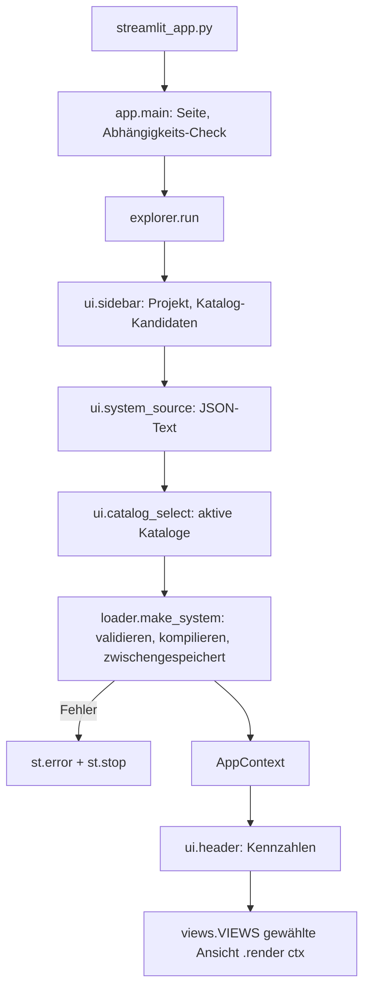

# Architektur

## Grundsätze

1. **Nur öffentliche API.** Der Explorer importiert ausschließlich `raytatouille` (und `analysis`,
   `plot`). Fehlt etwas, wird es in der Bibliothek beantragt, nicht umgangen ([ADR 0002](adr/0002.md)).
2. **Reine Logik getrennt von Oberfläche.** Alles, was sich ohne Streamlit und ohne Bibliothek testen
   lässt, liegt in eigenen Modulen ([ADR 0003](adr/0003.md)).
3. **Eine Ansicht = eine Funktion `render(ctx)`.** Ansichten lesen nur aus dem `AppContext`.

## Ablauf eines Laufs

Streamlit führt das Skript bei jeder Eingabe komplett neu aus.

## Module

| Modul | Aufgabe | braucht Bibliothek |
| --- | --- | --- |
| `builder` | Flächentabelle zu `.rtt.json`, Vorlagen, deutsche Fehlertexte | nein |
| `catalogs` | AGF/Coating lesen, Referenzen finden, Kataloge automatisch wählen | nein |
| `repo`, `colors`, `stretch` | Repo-Suche, Spektralfarben, Streamlit-Breitenschalter | nein |
| `compat` | `Features`: erkennt optionale Funktionen der Bibliothek | ja |
| `loader` | `make_library`, `make_coatings`, `make_system` mit `st.cache_resource` | ja |
| `drawing`, `rays` | Linsenschnitt zeichnen, freies kollimiertes Bündel | ja |
| `context` | `AppContext`, Beschriftungen, Strahlquelle | ja |
| `ui/*` | Seitenleiste, Systemquelle, Katalogwahl, Kopfzeile | ja |
| `views/*` | Analyseansichten, Register `VIEWS` | ja |

## Zwischenspeicher und Zustand

- `make_system` ist zwischengespeichert; Schlüssel sind JSON-Text, Katalogbytes, Coatingbytes sowie
  Temperatur und Druck. Fehler kommen als Text im Ergebnis zurück, nie als Exception.
- `st.session_state` wird nur vom Systembaukasten und der Kopfzeile benutzt: `preset`,
  `loaded_preset`, `bdf` (Tabelle), `bver` (Version des Editors), `bedited`, `focus_shift`,
  `glass_options`, `picker_row`, `picker_glass`. Ändert ein Knopf die Tabelle, erhöht er `bver`,
  damit der Editor neu aufgebaut wird.
- Widget-Schlüssel der Katalogauswahl enthalten Quelle und Referenzen, damit die Vorauswahl bei
  einem Systemwechsel neu berechnet wird.

## Neue Ansicht hinzufügen

1. `views/meine_ansicht.py` mit `TITLE = "..."` und `render(ctx: AppContext) -> None` anlegen.
2. In `views/__init__.py` importieren und in `_MODULES` an der gewünschten Stelle eintragen.
3. Rechnet sie etwas, das ohne Streamlit testbar ist, gehört das in ein reines Modul mit Unit-Test.
4. Rauchtest: Ansicht in `VIEWS` von `tests/test_app.py` eintragen.
5. Braucht sie eine optionale Bibliotheksfunktion: Flag in `compat.Features` ergänzen und die
   Ansicht bei fehlender Funktion mit `st.info` erklären statt abzustürzen.
